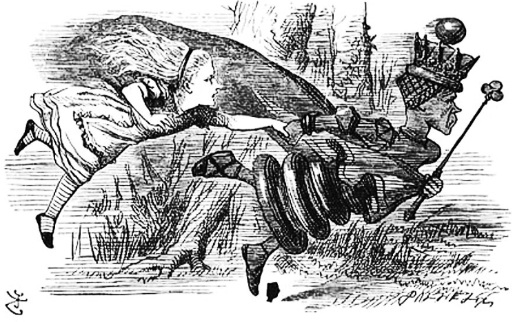

### Overview:

Geoscientists often need to manipulate datasets under four goals: Perfunctory processing, exploratory analysis, 
store for later, share with colleagues. A simple example is 'I would like to pull data from the ARGO database
and from satellite Sea Surface Temperature maps 
in order to understand the ocean temperature and pH variability in the Northeast Pacific over the past five years.' 
For subsetting and other procedural details you might refer to the 'multi-dimensional data' lesson portion of 
geohackweek; here we take it as a given that you managed to extract this data from its sources. 

 

 

> ## What does this have to do with basic cloud computing?
> Well the idea is to make a dry exegesis on cloud computing a little more interesting with a geospatial goal driving it.
{: .callout}

### Data concept set { compute, store, manage, web, services }

Prior to about 1990...

In the early 1990s...

Two notable products came out of this effort:
[netcdf](http://www.unidata.ucar.edu/software/netcdf/docs/), optimized
for climate data analysis, and [hdf](https://www.hdfgroup.org/), used for many applications including
distribution of remote sensing datasets. 

Witness the glory of [netcdf toolkits](http://www.unidata.ucar.edu/software/netcdf/software.html) 

### Common data handling methods:

spatial and temporal dimensions.

### Challenges:

Nonsense.
