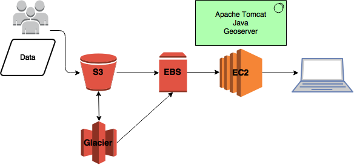

### Using the AWS s3 (Simple Storage Solution) bucket 

* Allows a bunch of people to dump in their data instead of giving everyone access to your virtual machine
* You can set access permissions
* s3 serves as backup - you can also move really old data that you don't need rapid access to to Glacier storage
* Use sync to transfer data from s3 to EBS
* Use s3 Lifecycle rules to move data that's older than X date to glacier

Since your data is stored on S3 there is no need to to re-download data when you want to do analysis on an AWS instance. You can use the S3 API to call your data. 

### Why use Geoserver?
* Web map and web feature service
* Open source :-)

### Set up Geoserver
* install Apache Tomcat (for stability, use Tomcat7)
* install PostGres
* install Geoserver
* Install OpenGeoSuite from Boundless!

### Costing
* s3 bucket - 3TB ~ $1100/year
* Glacier - 5TB ~ $450/year
* ec2 Instance (m4.large) with 2TB EBS ~ $3400/year
* Total cost ~ $5000/year

### AMIs
The good thing about setting your server up on the cloud is that you can easily create machine images! A machine image is a replica of your root applications and snapshots of your volumes (i.e. data). Caveat: You need to set up snapshots and there's a small associated cost. You can easily share your Geoserver setup with collaborators. 

### If you'relazy... 
I have an AMI created with Geoserver installed - I'll share.

### Ways to save $$$
1. You may not actually need 8TB of storage space! Don't be a data hog.  
2. Turn off your EC2 machine if you're not using it! 
